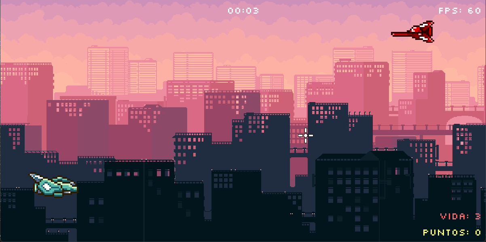

# Space SideScroller
A simple 2D sidescroller shooter. Destroy the enemy spaceships, earn points and resist as long as you can! Made with Python and Pygame.

## Recursos utilizados
- [sfxr.me](https://sfxr.me/) - Generador de efectos de sonido retro
- [Silkscreen - Google Fonts](https://fonts.google.com/specimen/Silkscreen) - Fuente tipográfica pixelada
- [4 Chiptunes Adventure - OpenGameArt](https://opengameart.org/content/4-chiptunes-adventure) - Música chiptune
- [Sci-fi Bullets - OpenGameArt](https://opengameart.org/content/sci-fi-space-simple-bullets) - Sprites de proyectiles
- [City Parallax Background - OpenGameArt](https://opengameart.org/content/city-parallax-background-with-buildings-pixel-art) - Fondo parallax
- [Explosion Animation 1](https://opengameart.org/content/explosion-animation-1) y [Marauder](https://opengameart.org/content/marauder) - Efectos de partículas
- [Gems - OpenGameArt](https://opengameart.org/content/gems-4) - Power-ups
- [Space Ship 2 - OpenGameArt](https://opengameart.org/content/space-ship-2) - Sprite de nave
